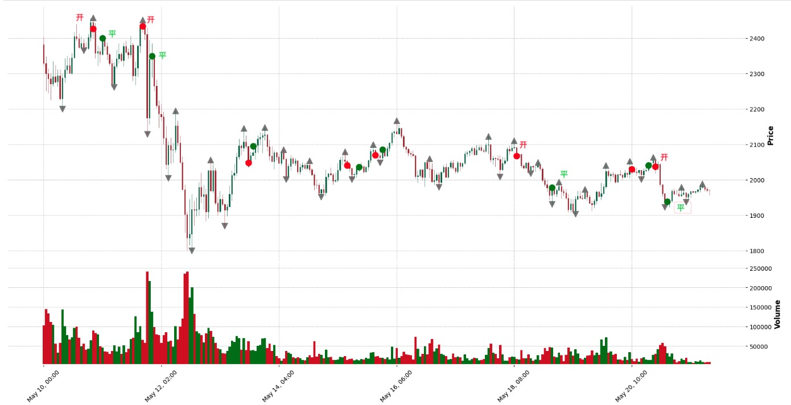

## Little Quantization

自定义策略 + 回测 + 币安自动化交易的最小实现<br>
目前实现做空策略, 下图所示，红色开空，绿色平仓 <br>
<br>


## 环境要求

- Python 3.10+
- 必要的 Python 库：`pandas`, `pydantic`, `loguru`, `pytz`, `dotenv`, `binance-python`, `sqlalchemy`
- 适用于 Windows 系统

## 安装指南

1. 克隆仓库到本地：

   ```
   git clone git@github.com:tosmart01/quantization.git
   ```

2. 安装所需依赖：

   ```
   pip install -r requirements.txt
   ```

## 使用说明

1. 配置 `config.settings` 文件，设置 `BINANCE_KEY`, `BINANCE_SECRET` 和其他环境变量。

2. 运行 

   ```
   python main.py
   ```

## 代码结构

- `main.py`: 主程序入口。
- `order/`: 包含 `OrderBinance` 类，负责币安订单执行逻辑,可自定义实现其他交易所
- `strategy/`: 策略模块，目前实现M头策略
- `client/`: Binance API 交互的客户端配置。
- `common/`: 常用工具和日志配置。
- `config/`: 项目配置和环境变量。
- `models/`: 订单表记录
- `schema/`: 数据模型和枚举类。
- `service/`: 邮件服务。
- `controller/`: 订单表ORM操作
- `dataset/`: 数据获取逻辑
- `notices/`: 通知模块，目前支持email
