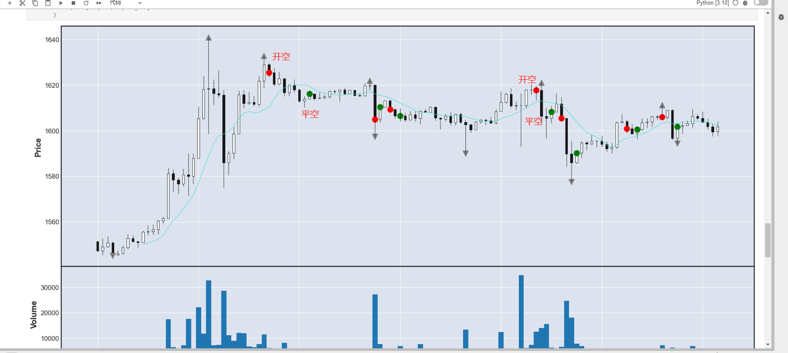
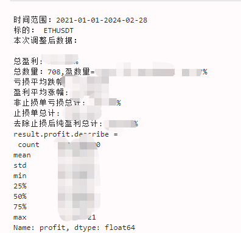
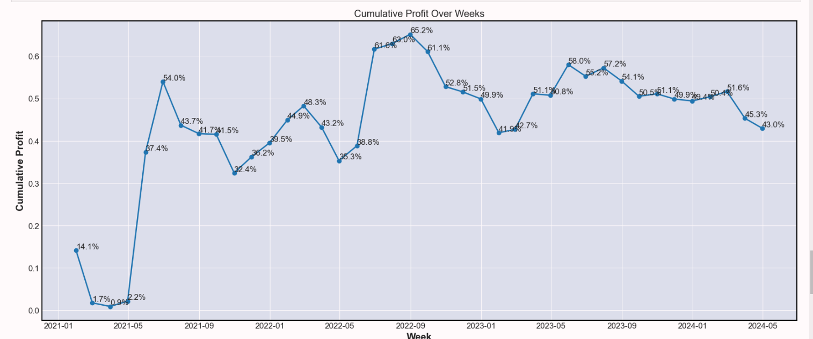

# CoinDreamer

## 经典技术分析与现代自动化交易的有机融合


**警告⚠️：** 请注意，整体杠杆比例请勿超过5倍，否则存在爆仓风险。

CoinDreamer 是一个融合传统技术分析与现代化自动交易的项目。致力于实现经典技术分析中的各种形态，
**M头、W底、头肩顶、头肩底、旗形整理、收敛三角、圆弧顶、圆弧底、钻石底、上升通道、下降通道**等。
结合现代自动化交易，对各种经典形态进行历史回测，实盘运行。
<br>
希望CoinDreamer能够为您的交易策略提供有效的支持和自动化实现。


### 经典形态实现列表
| 形态       | 是否实现 |
|----------|------|
| M头       | ✅    |
| W底       | ✅    |
| 头肩顶      | ❌    |
| 头肩底      | ❌    |
| 收敛三角     | ❌    |
| 圆弧顶      | ❌    |
| 圆弧底      | ❌    |
| VCP(杯柄形态) | ❌    |
| 上升通道     | ❌    |
| 下降通道     | ❌    |
| 旗形整理     | ❌    |
| 菱形底      | ❌    |
| 喇叭口      | ❌    |


### 项目特点：

- 提供(实盘测试验证过的) 自定义策略、回测功能以及币安自动化交易的最小实现。
- 目前已实现M头和W底等经典形态策略。下图演示了M头做空策略，红色表示开空，绿色表示平仓。
- 手续费统一按千分之一(0.001)计算，实际测试中，币安手续费在0.0009至0.00098之间(非VIP账户)。考虑到滑点，手续费统一按0.001计算。
- 最终结果仅返回开仓价、平仓价格、日期等字段，利润需统一减去0.001。

<br>



## 环境要求

- Python 3.10+
- 适用于 Windows/linux/mac 系统

## 安装指南

1. 克隆仓库到本地：

   ```shell
   git clone git@github.com:tosmart01/quantization.git
   ```

2. 安装所需依赖：

   ```shell
   pip install -r requirements.txt
   ```

## 使用说明

1. 配置 `config.settings` 文件，设置 `BINANCE_KEY`, `BINANCE_SECRET`, `PROXIES` 代理配置和其他环境变量。

2. 运行
   
   - 实盘运行
     <br>
   ```shell
   cd src
   python main.py --help
    Usage: main.py [OPTIONS]

    Options:
    --strategy [m_head|w_bottom]  策略选择，目前可选, m_head(M头),w_bottom(w底部)
                                  [required]
    --symbol TEXT                 币种选择，可选:XRPUSDT, BTCUSDT, BNBUSDT, BCHUSDT,
                                      RSRUSDT, LUNCUSDT, STGUSDT, ETHUSDT, EOSUSDT,
                                      ADAUSDT, RVNUSDT, ETCUSDT, DOGEUSDT
                                  [required]
    --interval TEXT               时间周期, 5m, 15m, 30m, 1h, 默认1h
    --help                        Show this message and exit.
   
   # 执行M头 ，ETHUSDT 1小时周期策略
   python main.py --strategy m_head --symbol ETHUSDT
   
   # 杠杆及金额设置
   !!! 杠杆和金额为动态配置，无需重启服务
   # 修改： order_info.json
    {
          "ETHUSDT": {
            "leverage": 5,
            "buy_usdt": "80%"
          },
          "BTCUSDT": {
            "leverage": 5,
            "buy_usdt": 100
          }
    }
    }
    杠杆: leverage 
    金额: buy_usdt , 可指定固定金额: 500, 指定仓位百分比: "80%", 全仓: "ALL"
   ```
   
   - 回测
     - 下载历史数据 python src/scripts/export.py
   
   - 运行回测
     
   ```shell
   # 默认准备了 eth 和btc 近三年数据, 新数据需要自己按上面流程下载
   python /src/strategy/tests/m_test.py
   # 结果输出路径为 /src/strategy/tests/{symbol}_backdump.json
   ```
   
   - 回测结果统计 
   
   
    


   ```python
   import json
   import pandas as pd
   data = json.load(open("symbol_backdump.json"))
   res = []
   for row in data:
       row['open_price'] = row['start_data']['close']
       res.append({k:v for k,v in row.items() if k not in ['start_data', 'end_data']})
   result = pd.DataFrame(res)
   result['start_time'] = result['start_time'].astype('datetime64')
   result['end_time'] = result['end_time'].astype('datetime64')
   result['profit'] = (result['open_price'] - result['close_price']) / result['open_price']
   result.profit = result.profit - 0.001
   result['profit_sum'] = result.profit.cumsum()
   note = """
   时间范围：2021-01-01-2024-02-28
   标的： ETHUSDT
   本次调整后数据：
   """
   win = result.loc[result.profit>0]
   loss = result.loc[result.profit<0]
   print(note)
   print(f"总盈利: {result.profit.sum():.2%}")
   print(f"总数量：{len(result)},盈数量=:{win.__len__()}, 亏：{loss.__len__()},比例: {win.__len__()/result.__len__():.2%}")
   print(f"亏损平均跌幅: {loss.profit.mean():.4%}")
   print(f"盈利平均涨幅: {win.profit.mean():.4%}")
   print(f"非止损单亏损总计: {result.loc[(~result.stop_loss)&(result.profit<0),'profit'].sum():.2%}")
   print(f"止损单总计: {result.loc[(result.stop_loss),'profit'].sum():.2%}")
   print(f"去除止损后纯盈利总计: {result.loc[result.profit>0,'profit'].sum():.2%}")
   print("result.profit.describe = \n",result.profit.describe())
   
   # 收益走势图
   result.start_time = result["start_time"].astype('datetime64')
   result['cumsum_p'] = result.profit.cumsum()
   summary = result.resample('1m', on='start_time').sum()
   summary['cumsum_p'] = summary.profit.cumsum()
   import matplotlib.pyplot as plt
   plt.figure(figsize=(20, 8))
   plt.plot(summary.index, summary['cumsum_p'], marker='o', linestyle='-')
   plt.title('Cumulative Profit Over Weeks')
   plt.xlabel('Week')
   plt.ylabel('Cumulative Profit')
   for i in summary.index:
       plt.text(i, summary.loc[i, 'cumsum_p'], f'{summary.loc[i, "cumsum_p"]:.1%}', fontsize='medium', verticalalignment ='bottom', )
   plt.grid(True)
   plt.show() 
   ```


## 代码结构

- `main.py`: 主程序入口。
- `order/`: 包含 `OrderBinance` 类，负责币安订单执行逻辑,可自定义实现其他交易所
- `strategy/`: 策略模块，目前实现M头策略
- `client/`: Binance API 交互的客户端配置。
- `common/`: 常用工具和日志配置。
- `config/`: 项目配置和环境变量。
- `models/`: 订单表记录
- `schema/`: 数据模型和枚举类。
- `service/`: 邮件服务。
- `controller/`: 订单表ORM操作
- `dataset/`: 数据获取逻辑
- `notices/`: 通知模块，目前支持email
